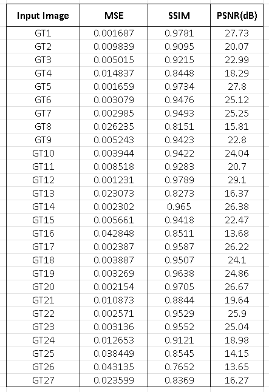

# Image matting using Bayesian theorem

## Description of the project
This task is a team assignment for the course 5C22 Computational Methods. This assignment performs compositing on the image based on the image, trimap and background image.

The contributors for the assignment are Xie Shuang, Aakash Revankar, and Li Ruowei.

---


## Installation 

To install the python libraries run the below command.

```sh                                 
pip install -r requirements.txt 
```

The requiremets.txt contains the following libraries:
```sh
matplotlib==3.7.1
numpy==1.23.5
opencv_python==4.7.0.72
Pillow==9.5.0
scikit_learn==1.2.2
scipy==1.9.1
skimage==0.19.3
```

## Execution
To run the algorithm, type the following command

```sh
python Main.py
```
To run the unit test for the program , run the following command
```sh
python unit_test.py
```
To run the e2e test for the file , run the following command
```sh
python e2e.py
```

To verify the sharpened image output, run the following command
```sh
python result_see.py
```


---

## Algorithm design
The mathematics, flow diagram, unit test and e2e performed is given in the powerpoint presentation. [Click here](https://github.com/xiesh527/BAYSIAN_MATTING/blob/main/Final_ppt_pre.pptx) for the presentation.

The algorithm has the following steps :

1. The image, trimap, and pixels are analyzed by separating them into foreground, background, and unknown pixels.
2. The unknown pixels are categorized into clusters of foreground and background using statistical measures such as mean, covariance, and maximum eigenvalue.
3. The expectation maximization algorithm is applied to calculate the values of the foreground, background, and alpha.
4. The compositing algorithm merges the alpha matte and background to create the final image.
---
## BAYESIAN_VERSION_1.0
## Unit test
1. A `dim_Testing` test that checks the dimensions of the input image, trimap, alpha matte, and composite image for validation purposes.
2. A `value_Testing` test that verifies the maximum and minimum values of the trimap.
3. A `test_window` test that ensures the clear functionality of the get window function.
4. A `test_Orchard_Bouman` test that validates the weight mean and covariances of the Orchard Boumann clustering algorithm.

## End-to-end testing
1. The laplacian alpha matte is generated using built in laplacian function with thresholding the pixels.
2. The laplacian alpha matte is compared with Bayesian matte.
3. The metrics such as MSE, PSNR and SSIM is calculated and the table is shown in the results section.
4. The corresponding bar graph is shown after running the end-to-end test.

## Novelty addition
1. The output of the Bayesian matting alpha image was sharpened by using Gaussian blur. Some of the images had lower MSE.

## BAYESIAN_VERSION_2.0
1. A `test_image_trimap` function added to test the image and trimap are same or not by calculating energy of background pixels by calculating the mean and variance of an image.
2. A `table.py` file created with a dictionary which has the value of the number of white pixels should be present in alpha when background energy is thresholded.
3. Metrics for each image is calculated as shown in the results section.

## Results
The metrics for different images is shown.



By seeing the above table we conclude that GT16 is the limit of Bayesian matting. We need to manually edit the pixels in the trimap.

Some matting results is as shown.


---
## Credits

This Bayesian matting code was developed for purely academic purposes for 5C22 compuatational method assignment.
Resources:
- Marco Forte's Bayesian matting algorithm.
- Research paper - 'A Bayesian approach to Digital Matting'

---
## Consultant 
Our team got help from the other team members, we found it difficulty with uploading our code to git and create a single main repository. 

- Uditangshu Aurangabadkar, Isaiah Isijola  as Git consultant.
- ChatGPT for making it easier to understand python errors by giving simple examples.


